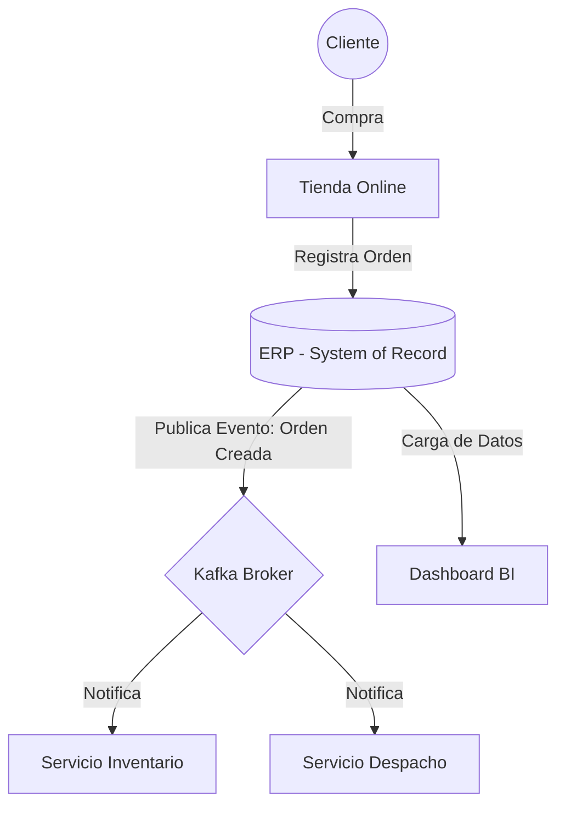

# Brief Ejecutivo-Técnico: E-commerce Retail

## A1) Arquitectura aplicada al caso
Nuestra organización es un E-commerce de Retail. El **System of Record (SoR)** es el ERP central que gestiona órdenes y clientes. Los sistemas satélites son el servicio de inventario y el servicio de despacho. Para conectar estos sistemas, utilizamos un broker de mensajes basado en **Apache Kafka** para lograr un flujo *Event-Driven* (orientado a eventos) para mayor escalabilidad y tolerancia a fallos.

### Diagrama de Arquitectura

## A2) Gobierno de TI (COBIT)

### Roles y Responsabilidades

- Dirección: Define estrategia y presupuesto.
- Gerente de TI: Responsable de disponibilidad técnica.
- Oficial de Seguridad (CISO): Cumplimiento y protección.
- Dueño de Proceso (Retail): Valida integridad de datos de ventas.

### Decisiones Gobernadas

- Fuente de verdad del cliente (SoR).
- Selección de proveedores Cloud/SaaS.
- Ventanas de mantenimiento crítico.
- Gestión de cambios en aplicaciones core.
- Política de accesos y privilegios.
- Plan de inversión tecnológica anual.

### Políticas Mínimas

- Accesos: MFA obligatorio y revisión de roles trimestral.
- Cambios: Todo despliegue requiere revisión de pares (Code Review).
- Backups: Respaldo diario con prueba de restauración mensual.
- Incidentes: Reporte formal y post-mortem obligatorio.
- Proveedores: Evaluación de seguridad antes de contratar un SaaS.

## A3) Riesgo y Seguridad (NIST CSF 2.0)

Para fortalecer la resiliencia del E-commerce, se ha evaluado el estado de ciberseguridad actual frente al objetivo deseado utilizando las 6 funciones del framework NIST.

### Perfil de Madurez: Actual vs. Objetivo

| Función | Perfil Actual | Perfil Objetivo |
|----------|--------------|----------------|
| Govern | Políticas informales basadas en necesidad inmediata. | Gobernanza centralizada y alineada al negocio. |
| Identify | Inventario manual en hojas de cálculo. | Gestión automatizada y mapa de dependencias. |
| Protect | Contraseñas simples y permisos amplios. | MFA obligatorio, microsegmentación y cifrado. |
| Detect | Revisión de logs tras incidente. | Monitoreo 24/7 con SIEM. |
| Respond | Reacción sin guías documentadas. | Playbooks por categoría. |
| Recover | Restauración manual. | DRP probado periódicamente. |

### Controles Priorizados

1. **Autenticación Multifactor (MFA)**  
   Mitiga ataques de robo de credenciales.

2. **Escaneo de Vulnerabilidades Semanal**  
   Identifica fallos antes de explotación.

3. **Microsegmentación de Red**  
   Evita propagación hacia el ERP.

4. **Cifrado de Datos en Reposo (AES-256)**  
   Protege información de clientes.

5. **Logging y Monitoreo Centralizado**  
   Detección temprana en servicios y Kafka.

6. **Programa de Concientización en Seguridad**  
   Reduce riesgo humano.

### Mini Plan de Respuesta a Incidentes

1. **Detección y Contención**  
   Aislar el sistema afectado inmediatamente.

2. **Erradicación**  
   Eliminar causa raíz (parches, rotación credenciales).

3. **Recuperación y Post-Mortem**  
   Restaurar servicios y documentar lecciones aprendidas.

## A4) Métricas (DORA + Operación)

- **Deployment Frequency (DORA)**: Frecuencia de despliegues.
- **Change Failure Rate (DORA)**: % de cambios que fallan.
- **Uptime / SLO**: Meta 99.9%.
- **MTTR**: Tiempo medio de recuperación.
